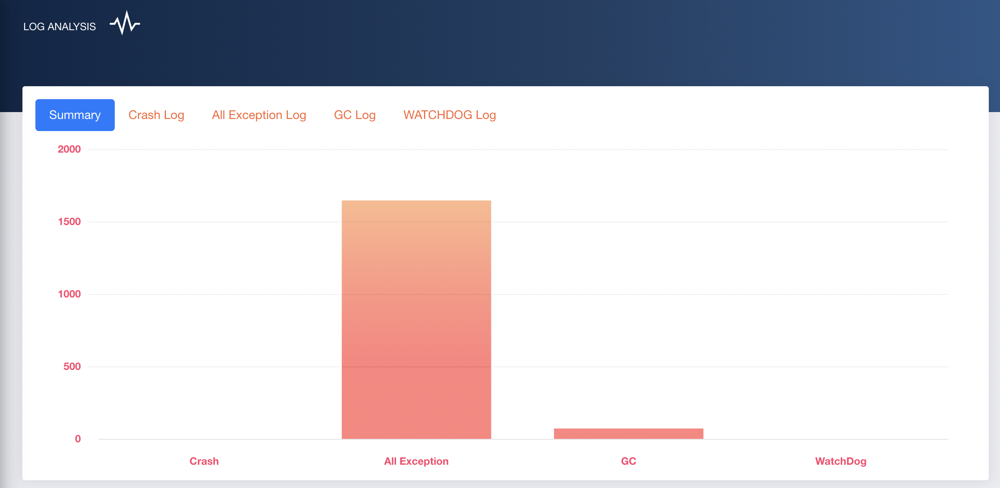

# Ape PC Framework.

## Usage
#### For Mobile Performance Monitor Tool

In Framework libs/
busybox - Integrates common Linux commands and tools, and extends the /system/bin command that comes with android
monitor.sh - Performance Monitor Tool
- push busybox & monitor.sh to mobile /data/local/tmp/
- chmod 777
- shell parameter  
montior_folder: output folder 
montiorWindow: FPS app windows com.adastragrp.hccn.capp.ui.activity.MainActivity for example
monitorPackages: com.hcc.app for example
monitor_interval: monitor interval like 2
meminfo_type: if greater or equal to 1 use dumpsys meminfo else use /proc/meminfo

After testing you can found performance data in montior_folder, format csv

if you want Analyze performance data, you can use monkeyutil/Monitor.py

#### For Android Mobile Monkey Enhance Testing

1. All Monkey Feature
2. 精准点击页面控件
3. 跳出马上拉回
4. "--act-whitelist-file" "--act-blacklist-file" activity 黑白名单
5. "--widget-whitelist-file" "--widget-blacklist-file" 控件黑白名单
6. 截图并绘制坐标
7. 根据页面控件数量智能选择操作事件
8. H5页面等待
9. Crash&ANR 定位帮助
10. 更多功能等待你发掘....

### 架构

